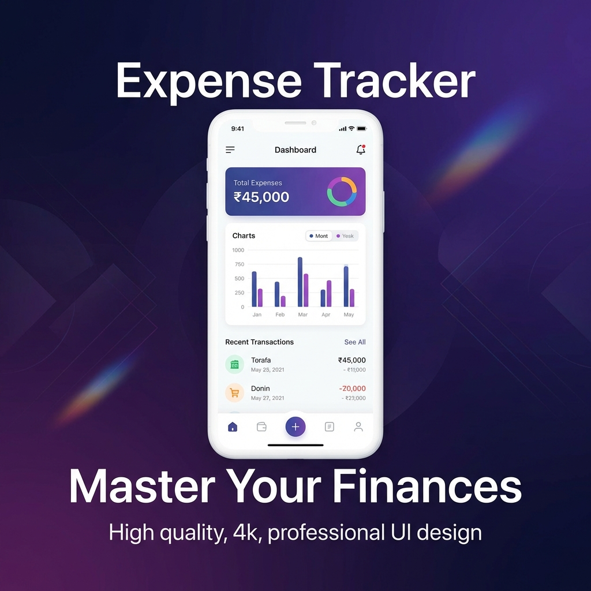
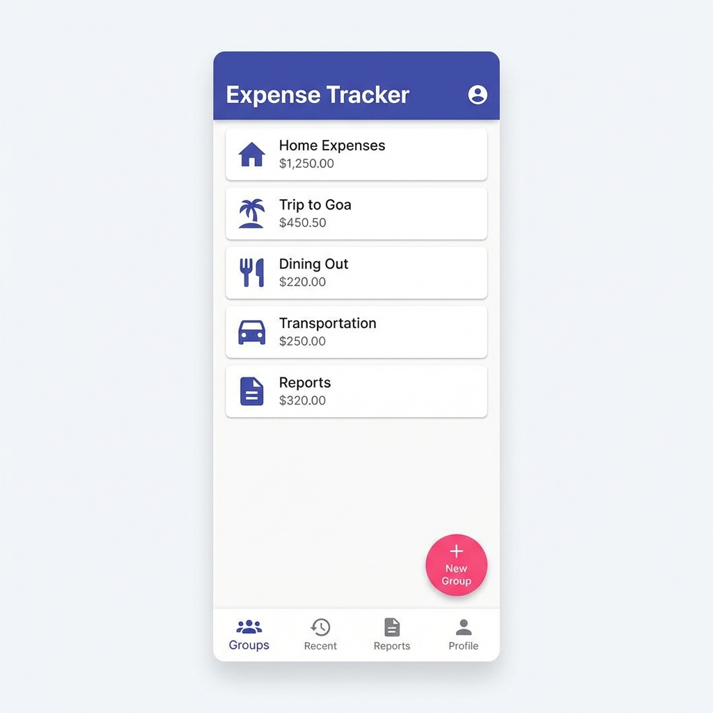
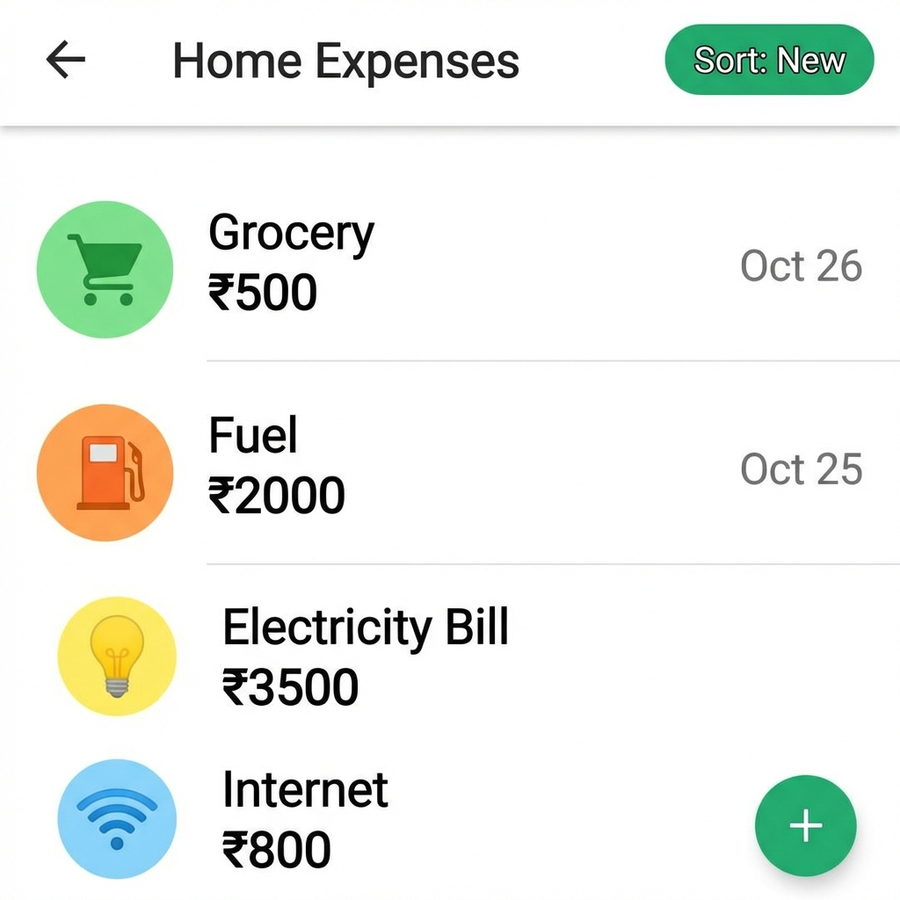

# 💰 Smart Expense Tracker

A modern, fast, and colorful expense tracker application designed for seamless group expense splitting and personal budget management.

## 🚀 Live Demo
**[Launch Application](https://expense-tracker-esia.onrender.com)**

## ✨ Key Features
- **👥 Group Sharing**: Create groups and split expenses instantly with friends.
- **📱 PWA Ready**: Install on your mobile phone for an app-like experience.
- **🎨 Modern UI**: Beautiful indigo-themed interface with smooth animations.
- **📅 Date Filtering**: Filter expenses by specific dates to track your spending habits.
- **📂 Category Views**: Drill down into specific categories like Grocery, Fuel, Dining, etc.
- **📊 Sorting**: Easily toggle between Newest and Oldest expenses.

## 📸 Screenshots

| Dashboard | Expenses & Filter |
|-----------|-------------------|
|  |  |

## 🛠️ Tech Stack
- **Frontend**: HTML5, Vanilla JS, TailwindCSS (CDN)
- **Backend**: Python (FastAPI)
- **Database**: SQLite (Local) / Postgres (Production)
- **Hosting**: Render

## 📦 How to Install (Mobile)
1. Open the [Live Demo](https://expense-tracker-esia.onrender.com) in Chrome on Android or Safari on iOS.
2. Tap the **Menu** (3 dots or Share icon).
3. Select **"Add to Home Screen"**.
4. Enjoy the full-screen app experience!
